## 期中作业——记事本

### 一、基础功能

#### 1、时间戳

+ 在数据列定义中加入COLUMN_NAME_MODIFICATION_DATE

+ 传入SimpleCursorAdapter构造

+ 在bindView方法中获取时间戳数据，并用formatDate方法格式化

  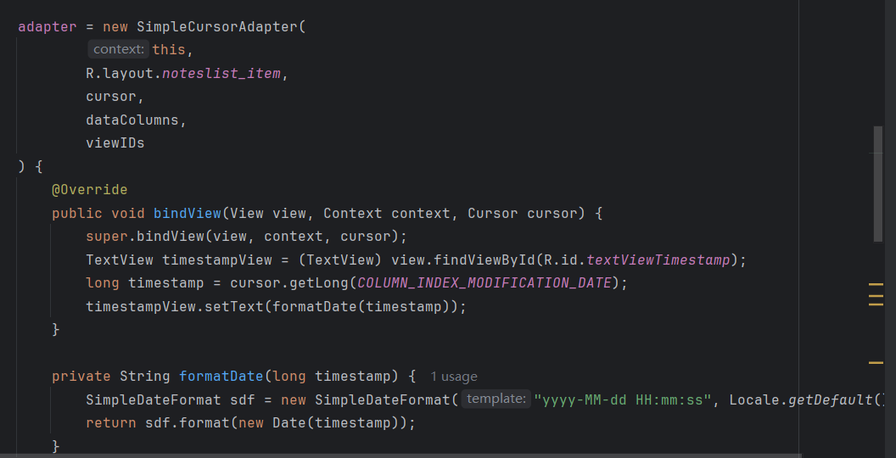

+ 结果如下

  

#### 2、笔记查询（按标题查询）

+ 创建activity_notes_list.xml文件

  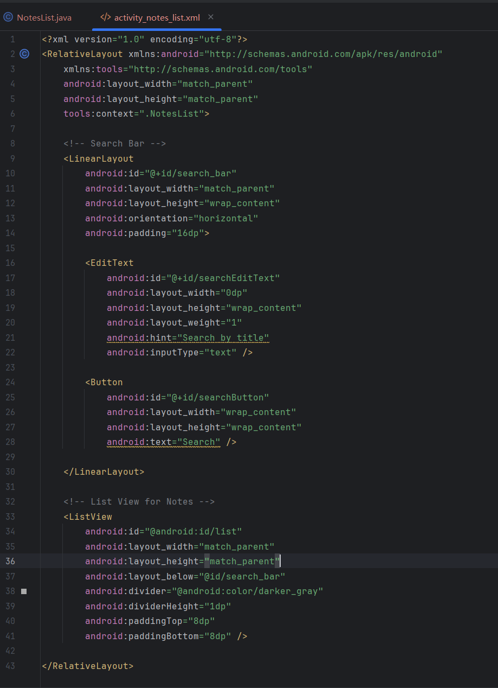

+ 找到search按钮并给按钮添加点击事件

  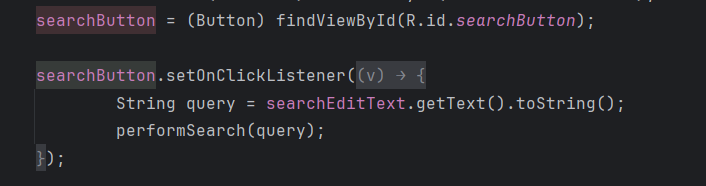

+ performSearch方法实现具体的查询逻辑

  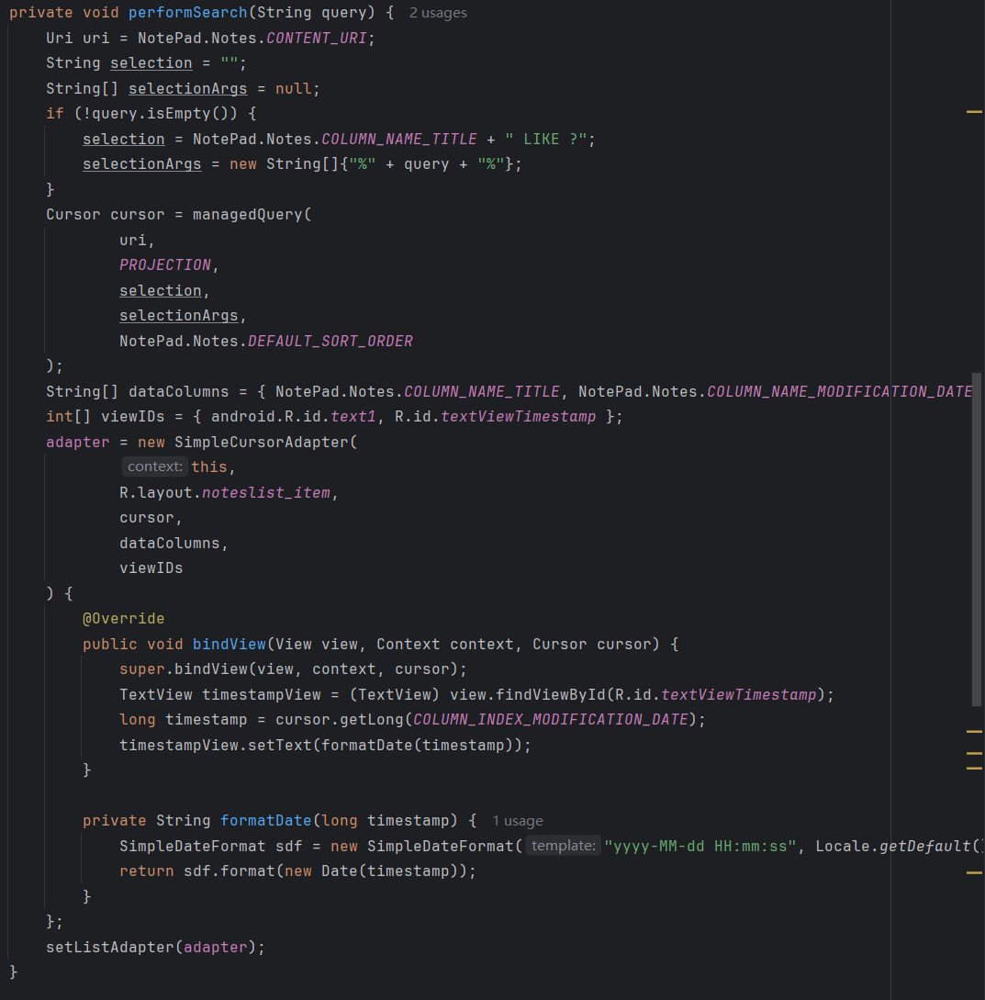

+ 结果如下

  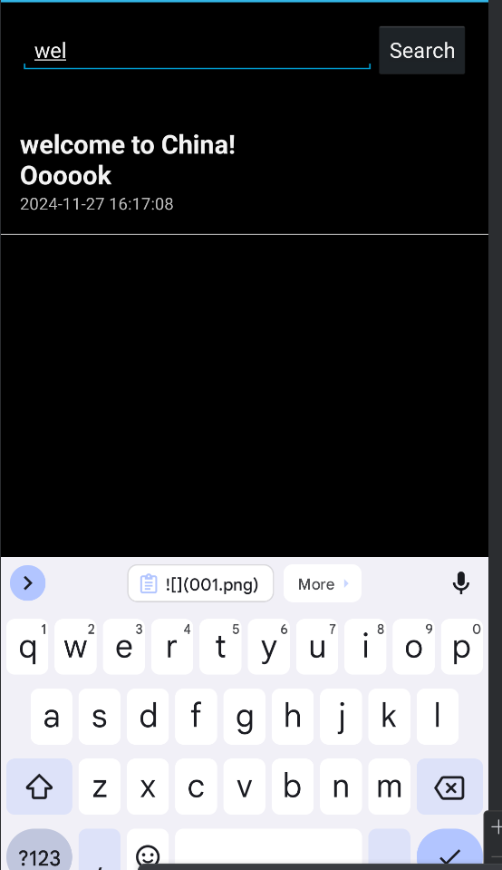

  

  

### 二、附加功能

#### 1、UI美化（更换背景主题）

+ 在menu的list_options_menu.xml中添加功能按钮

  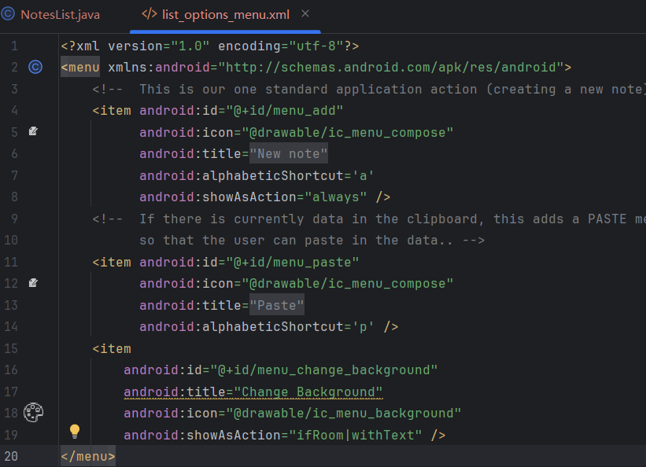

+ 在NoteList.java中添加按钮事件

  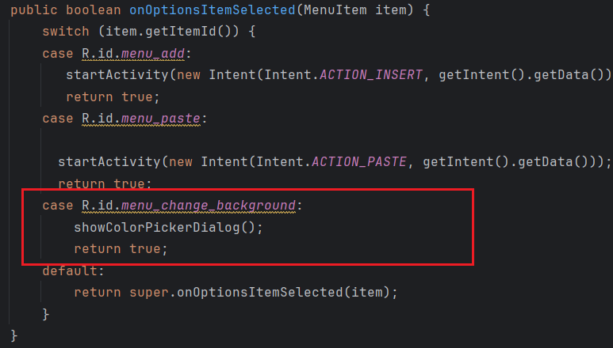

  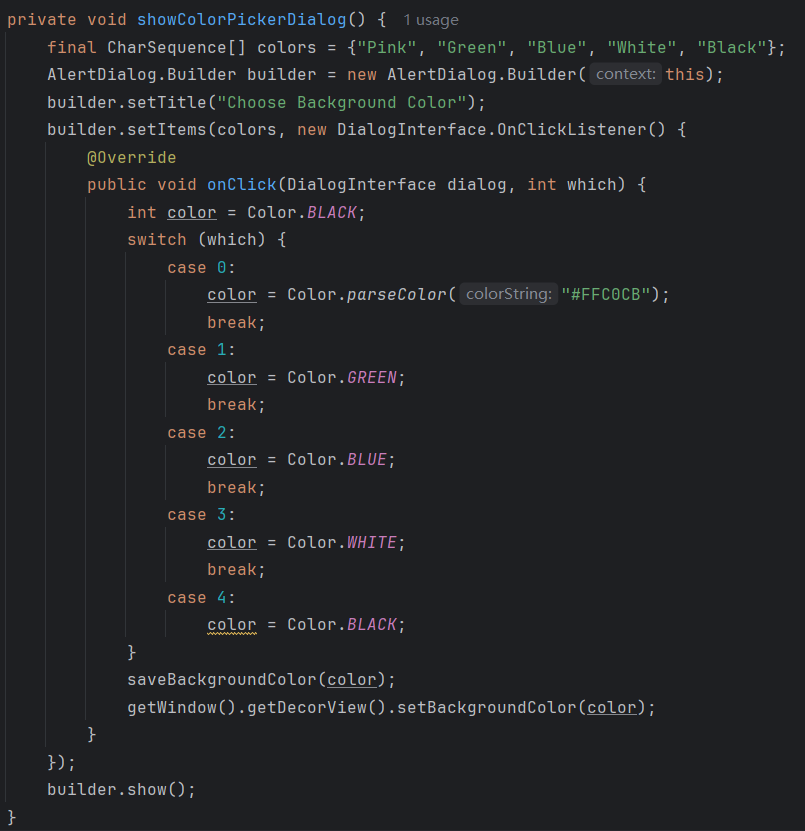

  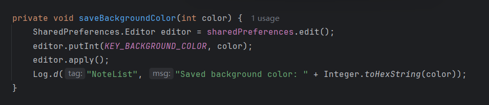

+ 结果如下

  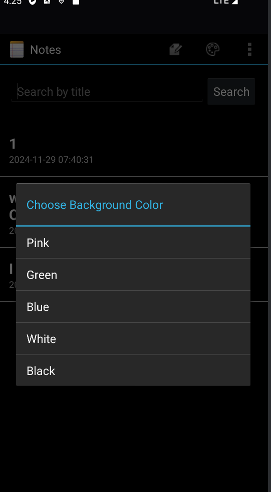

  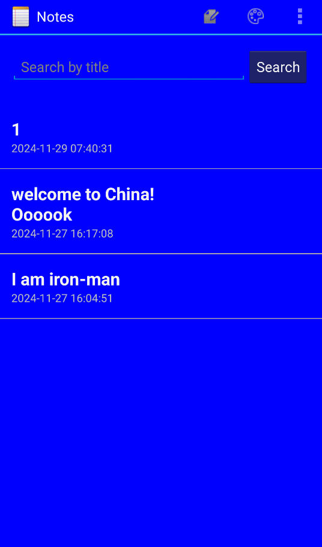

### 三、总结

​	通过这次期中作业，我深知自己在安卓方面的开发能力实在是相当的有限，很多地方有很艰难，做到这步属实不易，希望自己今后能够认真构思安卓的整体项目结构，为期末大作业做好准备。

